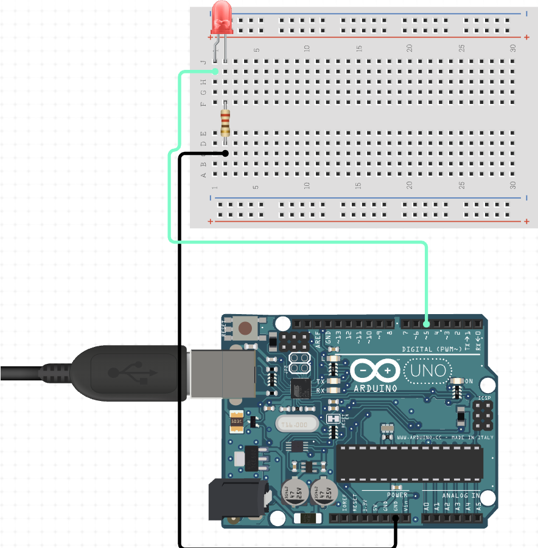
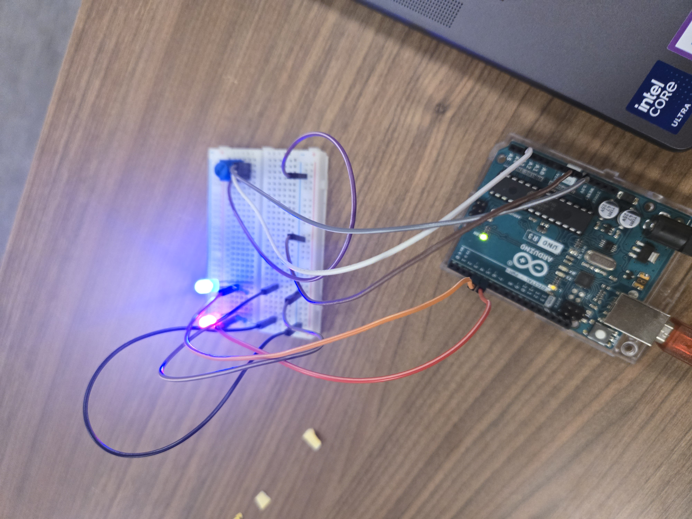

# Lab 1: LED Fundamentals

---

## Introduction

In this lab, we learned about the basics of LEDs and how to connect them up to an Arduino utilizing a breadboard.
The materials we used included an arduino board, a breadboard, jumper wires, LEDs (single color and RGB), a potentiometer, and resistors.
The end goal of the lab was to make the LEDs blink in various ways utilizing code sent to the Arduino.
The blinking rate could then later be controlled by the potentiometer.

---

## Part 1: Powering one LED

Just like it says, this is about gettong one LED powered via the Arduino. To achieve this, one LED was connected to the breadboard. One one rail was the positive side, and on the other rail was the negative side.
In this lab, I connected the resistor to the rail that had the negative side. Upon researching more, I found out that in most cases it does not matter which rail the resistor is connected to. After connecting the resistor, one jumper cable goes from the positive side to a numbered connector on the Arduino (for power from the board and control via code) and another jumper cable goes from the negative side to the ground connector on the Arduino.

I forgot to take a picture of what part 1 looked like, so for now here is the diagram of what it is supposed to look like.

---

## Part 2: Powering two LEDs (and Blinking LED with potentiometer)

This is like part 1 except now there are two of them. As both LEDs need to be grounded, the ground cables going from the resistors now all connect up to the same ground line, with one ground cable connected to the ground connector on the Arduino. We also now put the potentiometer into play, connecting it to the breadboard. This new device, combined with code, will allow us to chanmge how fast or slow the LEDs blink.

Here is a picture of what this looked like whenever it was completed.

---

## Part 3: RGB LED Control

Using an RGB LED is very similar to using a single color LED, however now there are four pins instead of two: R, G, B, and ground. Each pin for color should also have its own resistor. Then each rail for R G and B are connected to a different digital connector on the Arduino, which then utilizes whatever code is sent to it. During the lab, there were not enough resistors at the time, so I risked it by only having two. This worked, and did not short the LED out.

Here is a picture of what this looked like whenever it was completed.

---

## Reflection Questions

    What happens if you reduce the delay to 10ms?
      -Reducing the delay will make the LEDs blink faster.
      
    Why do we use resistors with LEDs?
      -To only allow a certain amount of voltage through, otherwise it could damage the LED.
      
    What challenges would arise using an RGB LED as a signal light?
      - More complex to implement vs standard Red/Green/Blue LEDs, more pins, could be confusing with different shades of colors
      
    How would you add a pushbutton to toggle blinking on/off?
      - A true/false state that is switched true or false each time the button is pressed.
