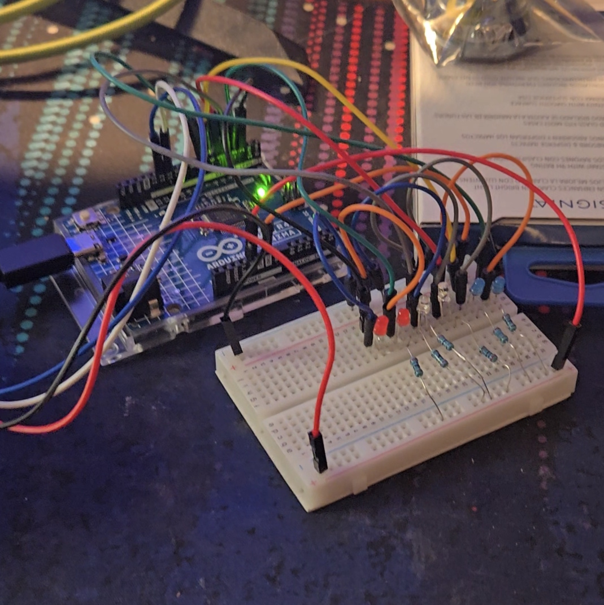

# Lab 3: Soldering a Sonic LED Level Meter

---

## Introduction

In this lab, we were to first 'draft' up a Sonic LED Level Meter on a breadboard, and then start soldering it on a PCB once it was working on the breadboard.
---

## Breadboard implementation

The implementation on the breadboard appears complex and crazy, but this was mainly do to using long jumper cables for each connection. The Sonic sensor was connected via jumper cables to the Arduino, while 6 LEDS (two red, two white, two blue) and 6 resistors (one for each LED) were connected to the breadboard. As each LED needed to be ground and also connected to the Arduino, this ended up with a lot of jumper cables.

Below is the breadboard implementation.

---

## Soldering to PCB

Next we began to solder each component to a PCB.

---
