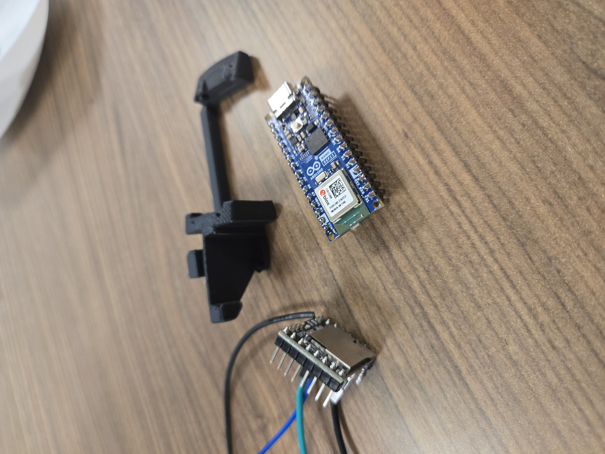
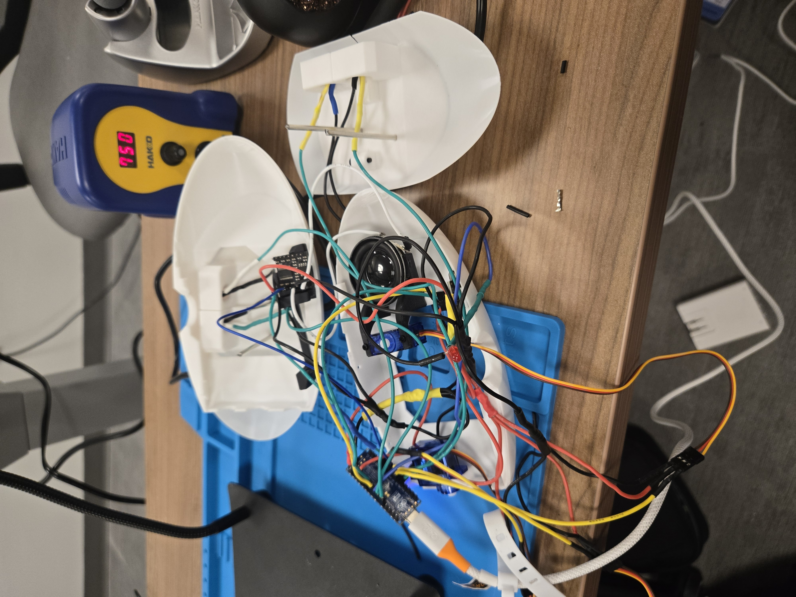
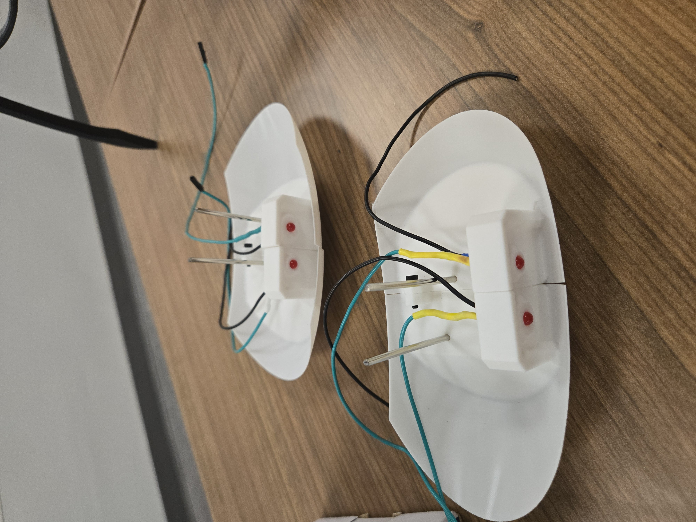
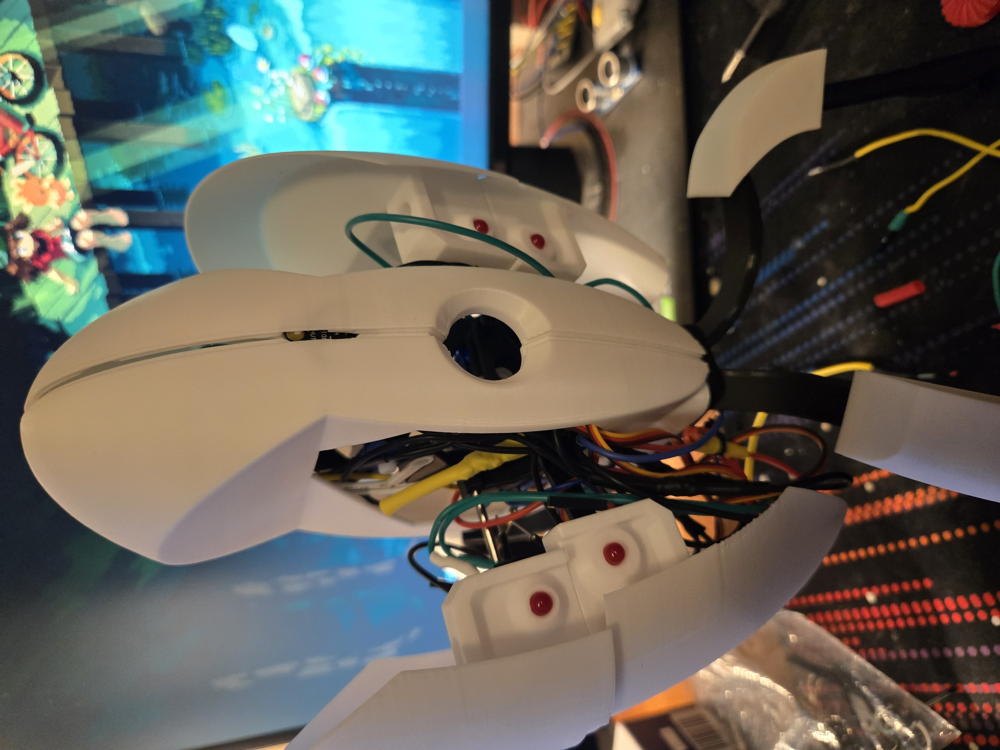
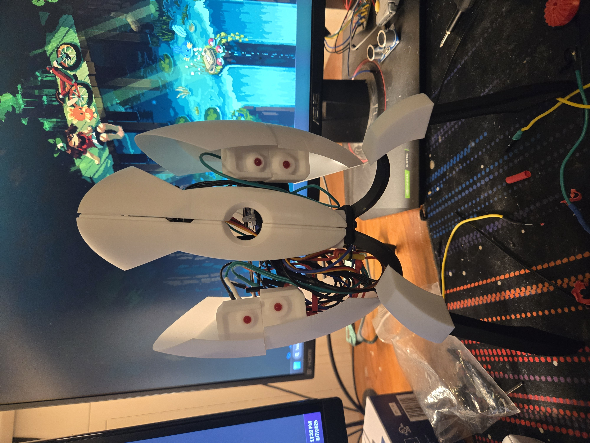

# Lab 4: Final Project

---

## Introduction

In this lab we were to choose a project to do that utilizes an arduino, sensors, and at least another piece of hardware (mine included servos, LEDs, a speaker, and also an MP3 module). I chose to attempt recreate the turret gun from Portal 2, from this source: https://www.instructables.com/Portal-2-Turret-Gun/

It was a learning experience, however it may have been too ambitious of a project for someone who has never messed with wiring or soldering before.
---

## First Steps

The first steps taken for this project were downloading and printing the 3D files for each part. This included the main shell, the wings, the legs, and all the internal parts that were supposed to make it swivel and open its arms.

Below is the 3D render of some of the parts needed.

---

## Next Steps

After all the parts were printed off, the device was temporarily pieced together to make sure everything fits. Internal parts such as the Arduino Nano and MP3 module were tested to verify that they fit in their internal holder that was also 3D printed.

---
## Wiring and Soldering

The majority of the time spent during this project was making wired pins and soldering wires together. This is where I learned different techniques on how to properly combine multiple wires together, solder them, and then put heat shrink over them to cover any wiring. This robot required lots of wires, and I think I honestly make the wires too long, and not compact enough.

---

## Final Outcome

Unfortunately, I was not able to get it finished and working. This was due to a number of things:

1. The type of Arduino board I used was different from the one in the original design.
   - In the original design, they used an Arduino nano without any pins at all. The Arduino nano I used was a standard one, with all pins attached. This meant that I had to connect all my wires via the square pin connectors. Half of the pins connectors I created for my wires ended up being loose, specifically the power and ground connectors for the mainboard. They kept slipping out up to the point where I decided that hours spent trying to get them to stay was not worth the trouble, as I had no tools at home to attempt to fix it. And even if they did fit, the internal holder for the Arduino did not have those square pin connectors in mind, making it nearly impossible to fit them in.
2. There is too much wiring all over the place.
   - Most of my wires were made longer, causing too little space internally.
3. Not enough time for what this project requires.
   - I did not anticipate the wiring and pins to cause so much trouble and time. If I had an Ardunio Nano without pins, I would be able to solder the wires directly to the board, freeing up space and time.

Here is the final image of what I got together before I decided that enough time was spent on something I am not able to currently finish. Maybe in the future I will try to complete it.

